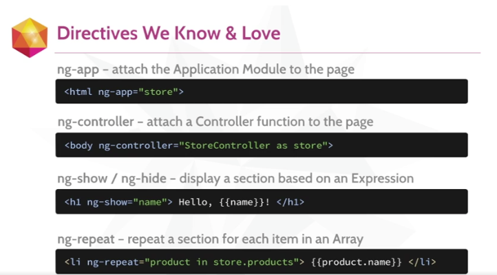

#Code School

***************************************
#CHAPITRE 1 - Directive, modules & expressions
***************************************

##Directive

une directive est un marqueur HTML qui dit à Angular d'activer un code _javascript_.


**ex**

```
<body ng-controller="StoreController">
```

Ce code indique à Angular de lancer la fonction (le *controller*) `StoreController`.


##Commencer à utiliser Angular

1. Télécharger la librairie `angular.min.js` depuis le site [http://angularjs.org](http://angularjs.org)
2. Appeler `angular.min.js` dans le code la page html
3. Demander à Angular de controller la page avec le controller `ng-app`


##Modules

C'est dans les **modules** que nous allons écrire notre application Angular. 

Le code est contenu dans des modules qui sont alors plus simples à maintenir et à tester.

C'est dans les modules que nous définirons les **dépendances**.

```
var app = angular.module('store', []);
```


Le code Angular sera stocké dans un fichier **app.js** (on va donc l'appeler dans notre fichier HTML)

Il faut donc aussi ajouter une directive au HTML 

```
<html ng-app = "store">
```
C'est ainsi que l'on crée une application Angular. 

##Expressions

Les **Expressions** sont utilisées pour inclure des valeur *dynamiques* dans le HTML 

ex : 

```
Je vaux {{4+6}}

```
Ce code affichera = *Je vaux 10* dans la page HTML.


***************************************
#CHAPITRE 2 - Controllers 
***************************************


##Controllers 

Les **controllers** permettent d'afficher des données dans le document HTML

Imaginons que nous avons un **objet javascript (JSON)** et que nous souhaitions l'afficher sur la page HTML

```
var gem = {
	name: 'Dodecahedron',
	price: 2.95,
	description: 'une très jolie gemme brillante'
}
```


Il faut d'abord créer un **controller** dans mon module 

```
app.controller('StoreController', function(){}
);
```

A présent, il faut intégrer la variable `gem`dans ce **controller**

```
app.controller('StoreController', function(){
	this.product = gem;
	}
);
```

Voilà, on est prêt à utiliser le controller nommé **StoreController** dans ma page HTML.


Dans une `<div>` , on va commencer par appeler notre controller avec `ng-controller`.

```
<div ng-controller = "StoreController as store">
```

Puis dans le document, on va intégrer nos directives

```
{{store.product.name}}
```


A présent, si on regarde notre fichier HTML `{{store.product.name}}`a été remplacé par le nom de la gem. 


***************************************
#CHAPITRE 3 - les directives intégrées
***************************************


##ng-show 
##ng-hide 

Deux directives intégrées  qui font quelque chose si une condition est vraie 

```
<div ng-show = "store.product.canPurchase">
````


##ng-repeat

La directive ng-repeat permet de parcourir un tableau. 

Dans le code HTML, on l'intègre de la façon suivante : 

```
<div ng-repeat  = "product in store.products"
```

`store.products`est le tableau intégré dans store. 

*Rappel : store  est l'alias de StoreController.*


**************************************************

#CE QUE NOUS AVONS APPRIS 


**DIRECTIVE** : code HTML qui déclenche un code javascript.

**MODULE** : intègre les composants de notre application.

**CONTROLLER** : comportement que nous ajoutons (un fonction par exemple).

**EXPRESSIONS** : valeur que nous affichons dans la page. 

****************************************************

 


***************************************************


***************************************
#CHAPITRE 4 - FILTERS
***************************************

Angular propose de filtres.

La notation avec un **pipe** indique à Angular = 
*Prend cette information et envoie-la à ce qui suit.*

C'est comme ça, qu'on va filtrer nos données. 

##Le format des filtres 

```
{{data | filter:options}}
```


##Filter Currency

```
{{product.price | currency }}
```

##Filter limitTo

Permet de limiter le nombre de résultats. 
On peut l'utiliser avec des `string` mais aussi avec la directive `ng-repeat`.

```
<li ng-repeat = "product in store.products | limitTo:3">
```

Renverra uniquement les 3 premiers résulats du tableau `store.products`.


##Filter orderBy

```
<li ng-repeat = "product in store.products | limitTo:3 | orderBy: '-product.price' ">
```


*********************************
#CHAPITRE 5 - Gestion des onglets
************************************


Imaginons que nous disposons d'une liste 

--------------
<section>
	<ul class="nav nav-pills">
		<li> <a href>Description</a></li>
		<li> <a href>Specifications</a></li>
		<li> <a href>Reviews</a></li>
	</ul>
</section>

**Rappels Bootstrap**
La classe `nav` définit un style correspondant à des onglets. 


On peut affecter des valeurs au moment où on clique sur un onglet sans même l'avoir défini avant.

###Affecter une valeur lors du click

Pour ça on va utiliser la directive `ng-click`

```
<a href ng-click="tab = 1">
```


###Afficher la div correspondante
On utilise ensuite la directive `ng-show` pour cacher ou montrer le contenu de la div visée. 

C'est simple 

```
<div class="panel" ng-show="tab === 1"> // ce code montrera cette div et cachera les autres. 
```


###Définir une div par défaut
On peut même définir une div à afficher **par défaut**

Dans <section>, on va utiliser `ng-init`


```
<section ng-init="tab = 1"> ... </section>
```

###Affecter une class dynamiquement. 
On va utiliser `ng-class` pour affect la classe `active`de bootstrap pour modifier dynamiquement le style de nos onglets.

L'astuce est que l'on peut donner un objet comme argument à `ng-class`.
On va donc lui dire d'affecter une classe après avoir évaluer la valeur d'un critère. 


```
<li ng-class="{active : tab = 1">... </li>
```


###ATTENTION 

Ok ça fonctionne mais il y'a un problème... on met trop de logique dans la page web. 
Cette logique devrait être déportée sur un controller !!!!! 

**********************************************

/!\ ECRIRE LE CODE

*********************************
#CHAPITRE 6 - les formulaires
************************************


##ng-model 

**ng-model** permet de lier (*2 way binding*) un champ de formulaire avec une valeur. 


