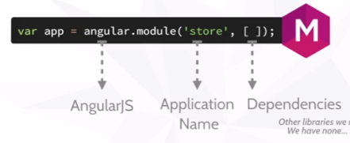

#Code School

***************************************
#CHAPITRE 1 - Directive, modules & expressions
***************************************

##Directive

une directive est un marqueur HTM qui dit à Angular d'activer un code _javascript_.


**ex**

```
<body ng-controller="StoreController">
```

Indique à Angular de lancer la fonction `StoreController`


##Commencer à utiliser Angular

1. Télécharger la librairie `angular.min.js` depuis le site [http://angularjs.org](http://angularjs.org)


##Modules

C'est dans les **modules** que nous allons écrire notre application Angular. 

Le code est contenu dans des modules qui sont alors plus simples à maintenir et à tester.

C'est dans les modules que nous définissons les **dépendances**.

```
var app = angular.module('store', []);
```



Le code Angular sera stocké dans un fichier **app.js** (on va donc l'appeler dans notre fichier HTML)

Il faut donc aussi ajouter une directive au HTML 

```
<html ng-app = "store">
```
C'est ainsi que l'on crée une application Angular. 

##Expressions

Les **Expressions** sont utilisées pour inclure des valeur *dynamiques* dans le HTML 

ex : 

```
Je vaux {{4+6}}

```


***************************************
#CHAPITRE 2 - Controllers 
***************************************


##Controllers 

Les **controllers** permettent d'afficher des données dans le document HTML

Imaginons que nous avons un **objet javascript (JSON)** et que nous souhaitions l'afficher sur la page HTML

```
var gem = {
	name: 'Dodecahedron',
	price: 2.95,
	description: 'une très jolie gemme brillante'
}
```


Il faut d'abord créer un **controller** dans mon module 

```
app.controller('StoreController', function(){}
);
```

A présent, il faut intégrer la variable `gem`dans ce **controller**

```
app.controller('StoreController', function(){
	this.product = gem;
	}
);
```

Voilà, on est prêt à utiliser le controller nommé **StoreController** dans ma page HTML.


Dans une `<div>` , on va commencer par appeler notre controller avec `ng-controller`.

```
<div ng-controller = "StoreController as store">
```

Puis dans le document, on va intégrer nos directives

```
{{store.product.name}}
```


A présent, si on regarde notre fichier HTML `{{store.product.name}}`a été remplacé par le nom de la gem. 


***************************************
#CHAPITRE 3 - les directives intégrées
***************************************


##ng-show 
##ng-hide 

Deux directives intégrées  qui font quelque chose si une condition est vraie 

```
<div ng-show = "store.product.canPurchase">
````


##ng-repeat

La directive ng-repeat permet de parcourir un tableau. 

Dans le code HTML, on l'intègre de la façon suivante : 

```
<div ng-repeat  = "product in store.products"
```

`store.products`est le tableau intégré dans store. 

*Rappel : store  est l'alias de StoreController.*


**************************************************

#CE QUE NOUS AVONS APPRIS 


**DIRECTIVE** : code HTML qui déclenche un code javascript.

**MODULE** : intègre les composants de notre application.

**CONTROLLER** : comportement que nous ajoutons (un fonction par exemple).

**EXPRESSIONS** : valeur que nous affichons dans la page. 


