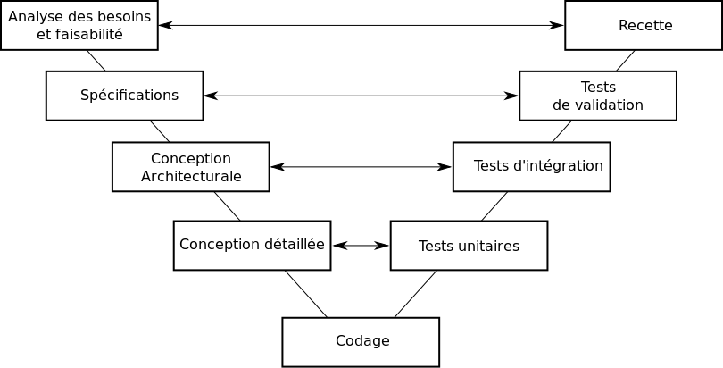

#Organisation d'un projet informatique

**************

_Objectif : comprendre l'organisation d'un projet informatique_

* Projet informatique

* Processus
  1. Processus de gestion -> chef de projet et ses objectifs
  2. Processus de production -> activité de développement
  3. Processus de qualité

##Délimiter le périmètre du projet

  1. Quels sont les objectifs ?
    * Economiques
    * Techniques
    * Délais
  2. Quels sont les moyens ?
    * Humains
      prestataire & disponibilité du client
    * Matériels
      où la prestation sera-t-elle produite, licence à acquérir
    * Financiers
      Identifier les moyens financiers du client pour le rapprocher de l'ambition du projet

Toujours se poser les questions des 2 points de vue :

  * point de vue client
  * de son propre point de vue

Une fois qu'on a défini le périmètre, on peut faire le decoupage en lot du projet. C'est le **lotissement**.

##Les acteurs du projet

###La maîtrise d'ouvrage

  * Décrit son besoin dans une expression de besoins ou **spécifications fonctionnelles détaillés**
  * Préparare les **tests fonctionnels**

###La maîtrise d'œuvre

  * Rédige le cahier des charges technique _(CDC)_ ou **étude technique**
  * Peut aussi être appelé **fournisseur** (en externe) ou **intégration** en interne.
  * **Intégration** : intégrer un nouveau projet dans un système informatique préexistant.
  * Conduit la réalisation de la solution technique.
  * Réalise les **tests unitaires** et les **tests d'intégration**.

##Gestion

###Type de contrats  

  * La régie
    * Contrat payé au jour le jour
    * Prestation réalisée chez le client
  * Le forfait
    * Forfait pour réaliser le projet
  * Les contrats mixtes
    * la partie maintenance ou formation se fait en mode régie

Le dilemme du **chef de projet**

    1 Coût
    2 Qualité
    3 Délais

La mission du chef de projet
  * estime le coût du projet
  * planifie
  * réalise le suivi du projet
  * analyse les données et les risques liés au projet.

### Estimation

#### 4 etapes

  * estimer la taille
    * par analogie
    * par comptabilisation(nbre de pages, de tables)
  * estimer la charge de travail
    * par l'histoire (j/h)
    * par les méthodes (putnam / kokomo)
  * estimer les délais
  * estimer les coûts

####Planification du projet

  * Découpage en tâches
    * **Work Breakdown Structure**
  * Résultat de la tâche
  * Rétro-planning (en partant de la fin pour définir la date de démarrage du projet) ou planning.

Pour réaliser un planning de **Gantt**, on peut utiliser `ProjectLibre`

####Mesurer
  * Mesurer
  * Mesurer le **Reste à faire**
  * Le compte-rendu d'activité **CRA**

####Analyser - le retour d'expérience

  * Les retards
  * Performance
  * Adéquation réalisations vs besoins

##Production

Comment est-ce qu'on travaille ensemble ?

  1. Organisation
  2. Conception
  3. Réalisation
  4. Exploitation

###Les types d'organisation

**Cycle Standard ou WaterFall**

Analyse de l'expression de besoin -> Conception technique -> programmation -> tests unitaires -> test d'intégration

Fonctionne sur des projets courts sinon il y'a un risque d'effet tunnel.

**Cycle en V**

Surtout utiliser pour de la maintenance opérationnelle

**Cycle en spirale ou itératif**

Méthodes Agiles / Itératives type SCRUM

###Conception

**Conception Générale**
quels sont les systèmes que l'on va pouvoir utiliser ?

* Serveur applicatif ? (apache / PHP)
* Système de gestion de bases de données

**Conception détaillée**

* Merise
* UML
* MVC

###Réalisation

Audit technique

  Programmation
    façon d'écrire le code
  Tests unitaires
  Audits techniques

  Environnement
    Serveurs de développement (bac à sable)
    Serveurs d'intégration
    Serveurs de recette (pour que le client teste)
    Serveur de pré-production (clone du serveur de production)
    Serveur de production

###Exploitation

  Correction

  Evolutions

  Projet

_Vocabulaire_ **TMA** = Tierce Maintenance Applicative

##Qualité

Plus le projet est volumineux (50 personnes) plus il y'a des chances qu'il y ai des personnes dédiées à la qualité.

Ce qui est évalué
  - capacité fonctionnelle
  - facilité d'utilisation
  - fiabilité
  - Performance
  - Maintenabilité
  - Portabilité

Pour cela, on établit un plan qualité =
  - fixer une métrique

Les tests
  - le nombre de lignes de code
  - le nombre de commentaires
  - la complexité des fonctions
  - la cohésion des différents modules
  - la taille et la fréquence de communication des données

Concernant les règles d'écriture du code il faut se référer au
**Google Javascript Style Guide**

###Qualité fonctionnelle

  * Couverture fonctionnelle des besoins réels des clients

  * Ergonomie générale et des facilités d'appropriation

  * Respect de la heatmap

  * Formulaire = pas plus de 4 étapes / avec un sentiment de progression _(cf Form Best practice sur Slideshare)_
  * Temps de réponse 
